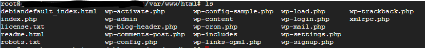
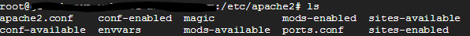

## システム環境

1クリックデプロイでGCEにWordpessをインストールした時のインストール先は下記の通り。OSはDebian。

Wordpressは/var/www/html



Apache2.4は/etc/apache2


余談だが、WEBターミナルからログインする際に自動作成されたユーザーは当然のようにsudo権限が割り振られている、便利すぎる。

## CDN有効化

最初はLet's Encryptの証明書を使おうと思っていたのだが、どうやらCloudflareを使う場合はSSLもCloudflareで用意してくれるそうなので一本化することに。

まずはCloudflareに登録してアカウント作成する。
ウィザード画面に従って進んでいくと、どうやらドメインのネームサーバーをCloudflareのものに切り替える必要があるらしい。\
せっかくお名前からGoogle Domainsに切り替えて信頼性が上がったと喜んでいたところなのだが…ここで代替サービスを探すのも面倒なので言われるがままに設定。

旧レジストラに登録されていた内容を自動的に反映してくれるあたりは非常に便利。\
DNSが切り替わった時点でCDN経由になっているため、CDN利用はこれで完了。非常にお手軽だ。

## HTTPS有効化

CloudflareのHTTPS利用は「Flexible」「FULL」「FULL(Strict)」の三種類がある。\
Flexibleはクライアント-CDNサーバのみ、FULLはクライアント-CDN-オリジン全てHTTPSで通信するがオリジンの証明書の正当性は検査されない（オレオレ証明書でも良い）。FULL(strict)はオリジンも正式な証明書である必要がある。

とりあえずFlexibleで設定し、後からFULL(Strict)に切り替える方針で作業をする。\
管理画面でHTTPS設定を切り替えるとまずはフロントのWEBサイトがHTTPSで通信可能になる。\
HTTPSサイトはリダイレクトさせたいので.htaccessの出番。以下の記述を追加。

```
RewriteEngine on
RewriteCond %{HTTPS} off
RewriteRule ^(.*)$ https://example.com/$1 [R=301,L]
```

巷ではWordPress管理画面がリダイレクトループを起こす不具合が定番になっているらしいが、起きなかったので無視。

次は、CDNからオリジンサーバへの通信をHTTPSにする。\
Cloudflareの管理画面から証明書のCSRと秘密鍵を手に入れることができるので、それをコピーしてApacheの適当なフォルダ内に突っ込む。

/etc/apache2/sites-availableにあるSSL用のデフォルト設定ファイルを見ると下記のディレクトリがお作法っぽいので同じ場所に入れる。

```
SSLCertificateFile      /etc/ssl/certs/gensobunya-net.crt
SSLCertificateKeyFile   /etc/ssl/private/gensobunya-net-private.key
```

Apacheの設定に追加して再起動。

```
a2ensite default-ssl.conf
service apache restart
```
CloudflareのHTTPS設定をFULLに切り替えてアクセス。\
この時点でうまく動かない。サーバーにはつながっているがファイルにアクセスできていないようだ…ということでWordPress用の設定を443に入れていないことに気がつく。

WordPress用confに記載されていた下記の内容をコピペ。

```
 <Directory />
    Options FollowSymLinks
    AllowOverride None
  </Directory>
  <Directory /var/www/html/>
    Options Indexes FollowSymLinks MultiViews
    AllowOverride All
    Order allow,deny
    allow from all
  </Directory>
  ScriptAlias /cgi-bin/ /usr/lib/cgi-bin/
  <Directory "/usr/lib/cgi-bin">
    AllowOverride None
    Options +ExecCGI -MultiViews +SymLinksIfOwnerMatch
    Order allow,deny
    Allow from all
  </Directory>
```

動いた。Cloudflareの設定をFULL(Strict)に切り替えて再度アクセス。\
証明書の警告が出る。疑問に思って見てみると、Cloudflareが提供してくれるSSL証明書はLet's encryptなどの証明書ではなく、Cloudflare発行のオレオレ証明書だった、そりゃ警告されるわ。

改めて証明書を取るのは面倒なのでHTTPS設定はFULLで完了とすることに。

## とりあえずWP環境完成

以上をもって、ブログ記事を安定して投稿できる設定は終わり。\
ただ、1週間くらい経ったあたりで下記の問題が頭に引っかかってくる。

+ GoogleDomainsでドメイン管理できていないのが気持ち悪い
+ Bloggerと同等のSEO・アドセンス・エディタ・画像圧縮などを出来るようにプラグインをインストールしたら管理画面が重い
+ 上記プラグインのセキュリティアップデートが面倒
+ プレビューが重い
+ 検証環境欲しい
+ 並行作業をしすぎるとメモリ不足でMySQLが落ちる（要サーバ再起動）


最後の問題が致命的で、ブログごときに監視自動化なんぞ入れたくないという決意のもとに別サービスの検討をしたところ、静的サイトジェネレーターのHugoを見つけた。

次回、Hugo+Netlify編。

<div class="amazlet-box" style="margin-bottom:0px;"><div class="amazlet-image" style="float:left;margin:0px 12px 1px 0px;"><a href="http://www.amazon.co.jp/exec/obidos/ASIN/4295000795/gensobunya-22/ref=nosim/" name="amazletlink" target="_blank"></a></div><div class="amazlet-info" style="line-height:120%; margin-bottom: 10px"><div class="amazlet-name" style="margin-bottom:10px;line-height:120%"><a href="http://www.amazon.co.jp/exec/obidos/ASIN/4295000795/gensobunya-22/ref=nosim/" name="amazletlink" target="_blank">いちばんやさしいWordPressの教本第3版 人気講師が教える本格Webサイトの作り方 (「いちばんやさしい教本」)</a><div class="amazlet-powered-date" style="font-size:80%;margin-top:5px;line-height:120%">posted with <a href="http://www.amazlet.com/" title="amazlet" target="_blank">amazlet</a> at 17.10.07</div></div><div class="amazlet-detail">石川栄和 大串 肇 星野邦敏 <br />インプレス (2017-02-24)<br />売り上げランキング: 1,320<br /></div><div class="amazlet-sub-info" style="float: left;"><div class="amazlet-link" style="margin-top: 5px"><a href="http://www.amazon.co.jp/exec/obidos/ASIN/4295000795/gensobunya-22/ref=nosim/" name="amazletlink" target="_blank">Amazon.co.jpで詳細を見る</a></div></div></div><div class="amazlet-footer" style="clear: left"></div></div>
