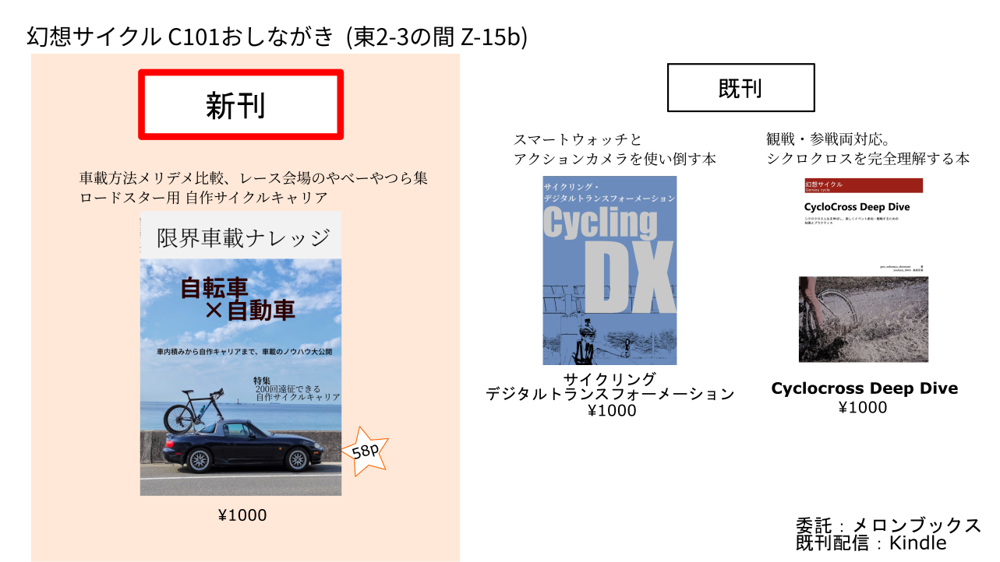

## スペース・LINK

**2 日目(12/31) 東2ホール Z-15b**です

### 関連リンク

- [コミケWebカタログサークルページ](https://webcatalog.circle.ms/Perma/Circle/10349446/)
- [Circle.msサークルページ](https://portal.circle.ms/Circle/Index/10349446)
- 既刊1: [サイクリング・デジタルトランスフォーメーション](/portfolio/c100/)
- 既刊2: [Cyclocross Deep Dive](/portfolio/c99/)

## 【新刊】限界車載ナレッジ

ロードバイクなどの車載、なんとなくやっていませんか?

中積み・ルーフキャリア・トランクキャリア・吸盤キャリアなど、基本的な積み方のメリット・デメリットを比較して、レンタカーでも使えるノウハウを紹介しています。

メインコンテンツは、ロードスターの自作ルーフキャリア製作について!
「その気になればどんな車にも自転車が2台は乗る」を裏付ける試行錯誤をお楽しみあれ

**本文58ページ**。

会場価格1000円

### サンプル

以下のサンプルは執筆中のものです

### Special Thanks

- [Vivliostyle](https://vivliostyle.org/)
- [Inkscape](https://inkscape.org/)

### 通販・電子版

委託通販は[メロンブックス](https://www.melonbooks.co.jp/detail/detail.php?product_id=1747534)様、電子版はKindleでそれぞれ頒布・配信予定です。

なお、弊サークルの同人誌は全て[Kindle Unlimited](https://amzn.to/3GsXhaT)にて読み放題の対象となっています。複数冊購入の場合は非常にお得となっておりますのでご検討ください。

