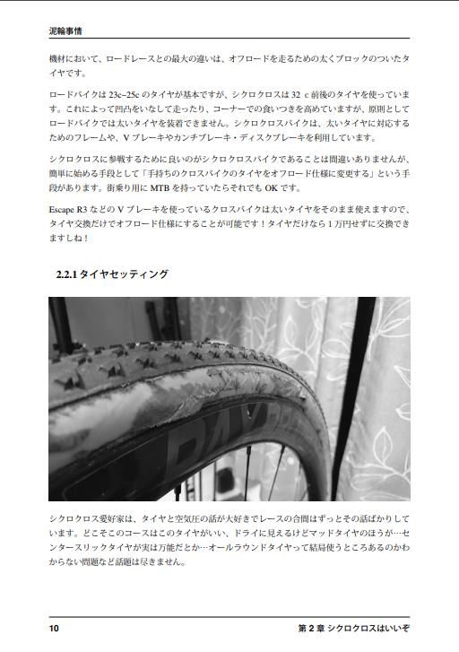

## 【新刊】泥輪事情



シクロクロスの魅力をあらゆる面からアピールし、シクロクロス人口を爆増させる事を目的とした本です。気合が入りすぎてまずページ数が普段の1.5倍以上になってしまいました。

シクロクロスレースに関するカテゴリシステムや機材の疑問を紹介しつつ、Twitter上で行ったシクロクロッサーへのアンケートや、シクロクロスを語る上で欠かせない「フォトグラファー」達からシクロクロスの魅力を語ってもらいます。  
おまけで筆者が今年のCX全日本選手権に参加したレポートを載せています。  
全**56**ページ、頒布価格￥500

### Guest Photographer

[@ratsCRZ](https://twitter.com/ratscrz)  
[@nakachan_k](https://twitter.com/nakachan_k])  
[@youkan_0045](https://twitter.com/youkan_0045)  
[@Nishimura_2015](https://twitter.com/Nishimura_2015)  

## 【既刊】大阪北部飯ポタ本＋



大阪北部の飯ポタスポットを、エネルギー消費のためのライド情報と一緒に紹介。\
おまけとして、「神奈川県民でも満足できる大阪の家系ラーメン屋」を収録。\
全32ページ、頒布価格￥500

## 【既刊】2017冬王滝　現場レポート


氷点下のスタート、過去最長の100kmコース、凍りつく機材…11月の王滝で何が起こっていたのか？完走率25%のアドベンチャーレースの記憶をたどる。\
会場限定。全44ページ、頒布価格￥500

## 既刊電子版　DLカード



過去作のイラスト・写真をフルカラーにしたPDFファイルのDLコード付きカード。\
購入すると2018/12/31までオリジナルファイルをダウンロード可能です。
PDFなのでKindleに入れて電子書籍として楽しむことも可能。\

特にDRM等はしかけていませんが、公衆への再配布は禁止とさせていただき、発見次第然るべき処置を取らせていただきます。

各200円
