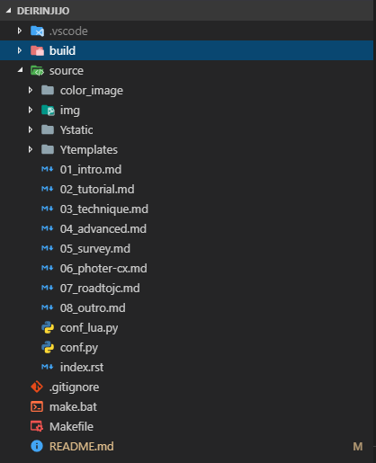

## 電子書籍も紙書籍もキッチリ作りたい！

幻想サイクルの活動では、完全オリジナルであることを活かして現物の同人誌頒布だけでなく、電子媒体での配信も意欲的に行ってきました。

[Booth](https://gensobunya.booth.pm/)でのPDF版の頒布を皮切りに、[Amazon kindle](https://amzn.to/2uyzRNW)、BookWalker（現在は停止）で配信をはじめ、今ではKindle Unlimitedでも読めるようになっています。

実績から言うと、人気は「紙媒体＞＞＞Kindle＝Kindle Unlimited＞＞＞＞＞＞＞＞＞その他」となっています。思ったよりで電子版の配信が好評で驚いています。

しかし…実は、現在配信している同人誌には文字情報がありません。Illustratorで作成している都合上、文字情報を維持したままepubファイル（電子書籍形式）を作成することが手持ちのソフトでは困難だったためです。Boothで配信しているPDFは文字情報を維持できているので、コンテンツの質としてはKindle版より上なのですが利便性はそれに優るようです。  
※PDFでもKindleモバイルアプリで読むことは可能です

実用寄りの本を書いていることもあり、せっかくなら文字検索ができる状態の本を出してもらおうとしたのが[C95の新刊「泥輪事情」です](../c95/)。

技術書典が公表を博していることもあり、1ソースから印刷用のファイルと電子書籍用のファイルを出し分けることに関するノウハウがいくらか溜まっていることは把握していたので、ITを仕事にしているものの端くれとして興味が昂ぶっていたこともあり、原稿ファイルから複数の入稿ファイルをビルドするスタイルに挑戦しました。

以下、検討から出力までかなりの長文が続きますが、最終的に下記のツールでPDFの出力まで持ち込みました。

* 原稿：Markdown
* ビルド：Sphinx＋RecommonMark
* TeXLive 2018

`conf.py`が含まれたリポジトリは下記のとおりです。ビルド方法はREADME参照のこと。

>[Github : gentksb/md2doujin_sphinx](https://github.com/gentksb/md2doujin_sphinx)  
><https://github.com/gentksb/md2doujin_sphinx>

## プランニング

### 入稿要件

印刷用の原稿は、同人活動開始以来お世話になっている、[ラック出版](http://www.luck-pb.jp/)様の入稿ファイルを要件として設定します。移動体通信事業者のプランがかわいく見える印刷所の料金体系の中で、非常に明快な印刷メニューと割引メニューを準備している素晴らしい印刷所です！（ダイレクトマーケティング）

入稿はPDF形式です。要件は[こちらのページ](http://www.luck-pb.jp/gen6.html#doc)に記載されている通り、大きく下記の3点です。

- フォントは全て埋め込み
- PDF/X-1a形式
- ページ設定---原寸

出力時に上記を満たしている必要があります。epubは出力してくれればなんとかなる（中身はHTML）なので対して問題にならないだろうと割愛。  
技術系同人誌はA5が多いですが、評論かつ弊サークルの前例に従いB5サイズを作成するものとします。

### Wordじゃだめなの？

ドキュメントビルドのフレームワークを使うことで、ノンブルの設定や目次の自動生成などの細かいあれこれから開放されるためです。

Wordでもできる？こまけえこたあいいんだよ！あと自宅PCはずいぶん前にGoogleに入信したためOfficeが一切入っていません。あと出先でChromebookを使って執筆したいのでOfficeは（個人的には）一切使いません。

### フレームワーク

今回のメインとなるお題です。パッと見た限り、情報と実績が豊富なのは下記の手段。  
ソースは使い慣れているMarkdownをメインで使うことを前提としています。このサイトもブログもMarkdownなので、生産性という名前の慣れは抜群。

1. Pandoc
1. Sphinx + RecommonMark
1. Re:View + md2review

ここで、最終的に「LateXを使ってPDFを出力する」という点は逃れられないことに気が付きます。若干の不安を抱えつつもネイティブにMarkdownを扱えるPandocがいいなとこの時点では考えていました。どうしてもMarkdown記法で解決できない問題が出てきた際に、SphinxはReST、Re:ViewもRe:View記法を新たに理解する必要があるからです。

新しい記法を覚えるくらいなら原稿に力を注ぎたいので、まずはPandocの参考になる情報を漁り、下記のページに行き当たります。  
情報をあさっている間、並行してMarkdownで構造に気を使いつつ原稿を書いていきます。

>[Pandoc + LaTeX で markdownからA5・縦書・2段組の小説本のPDFを作成](http://adbird.hatenablog.com/entry/2017/01/15/010459)
><http://adbird.hatenablog.com/entry/2017/01/15/010459>

バッチリドンピシャやんけ！！！！！！！

こちらの記事を参考に、章ごとに分割した`.md`ファイルを準備してビルド！と思うもよく見るとTeXのテンプレートファイルを使ってそこに流し込んでいる＝TeXの知識がないと細かいことができない、という点に気が付き候補から脱落。素のビルド内容でも試してみましたが、後述するSphinxに比べあまりにも味気ないので、作り込みの時間をとっていないこともあって残念ながら却下となります。

Re:viewはかなり版組み向けの言語でしたが、それゆえに原稿の可読性が著しく落ちているのでやめておきました。

## Sphinx＋RecommonMarkでオフセ本に耐えるPDFを出力する

ようやく本題です。Sphinxは優しいので`sphinx-quickstart`を実行するだけでいい感じにディレクトリを作ってくれます。
こちらは脱稿時のリポジトリです。



`nn_題名.md`が各章の原稿、`index.rst`がビルドの開始地点です。残りの設定はすべて`conf.py`の中。`conf_lua.py`はpLateXではなくluaLateXで出力しようとして失敗したときの名残です。  
本来、`index.rst`の内部でファイルのインポート順を決定できるため、`.md`ファイルにプレフィックス番号は不要なのですがPandoc用に原稿を作成した名残です。

### Markdown利用

まずはSphinxでMarkdownを使えるようにします。  
RecommonMarkとAutoStructifyをインポートしてググって出てきた内容を追加します。

下記の内容を`conf.py`に追記・編集していきます。

```python
import recommonmark
from recommonmark.parser import CommonMarkParser
from recommonmark.transform import AutoStructify

# recommonmark の拡張利用
github_doc_root = 'https://github.com/rtfd/recommonmark/tree/master/doc/'
def setup(app):
    app.add_config_value('recommonmark_config', {
            'url_resolver': lambda url: github_doc_root + url,
            'auto_toc_tree_section': 'Contents',
            }, True)
    app.add_transform(AutoStructify)
```

次に、.mdファイルを原稿ファイルと認識させます。

```python
# The suffix(es) of source filenames.
# You can specify multiple suffix as a list of string:
#
source_suffix = ['.rst', '.md']
# source_suffix = '.rst'

source_parsers = {
    '.md' : 'recommonmark.parser.CommonMarkParser'
}
```
この時点で、ビルドコマンドを打って`.md`ファイルが原稿で使えるようになりました。  
PowerShellだとディレクトリ内に実行ファイルがあっても明示的にパスを指定する必要があるのでめんどいです。

```powershell
.\make clean
.\make latexpdf
```

### Goodbye、Markdown Table

ここで原稿を見ているとあることに気が付きます。**テーブルが出力されていません**。

RecommonMarkはCommonMarkという標準Markdownのみをサポートしているため、みんな大好きGithub Flavored Markdownでサポートされている表組は対応していません。  
残念ですが**ReST記法を用いたテーブル**に書き直す必要がありました。

前節のAutoStructifyは、`.md`ファイルの中でReST記法を使えるようにしてくれます。下記のように`eval_rst`で囲ったコードブロック内をReSTで解釈してくれます。

```
```eval_rst
============   ==========
出走内容        昇格内容
============   ==========
6人未満         昇格無し
6人以上で1勝    昇格できる
6人以上で2勝    昇格は必須
============   ==========
```

`conf.py`でimportするだけでなく、定義も宣言しないと動作しないので注意。

```python
github_doc_root = 'https://github.com/rtfd/recommonmark/tree/master/doc/'
def setup(app):
    app.add_config_value('recommonmark_config', {
            'url_resolver': lambda url: github_doc_root + url,
            'auto_toc_tree_section': 'Contents',
            }, True)
    app.add_transform(AutoStructify)
```


### 原稿の見た目はできた、出力形式が問題だ

残念ながら、ここから**LateXの設定**と格闘することになります。`conf_py`で`latex_elements`の設定内にメタデータをJSONライクに書いていくのですが、大半の設定は`preamble`というLateXの設定を直書きできる箇所でレイアウトを指定します。

文字サイズ、開き方向、原稿サイズ以外はほぼLateXです。B5サイズを使っている人がなかなか居なかったのですが、`'papersize': 'b5j'`を指定すれば、LateXの設定抜きでB5サイズで出力できます。

なお、最新版のSphinxでは`latex_documents`に`manual`を指定した場合自動的にLatexのレイアウトがjsbook形式で出力されるので、インターネッツの海に浮かんでいるmanualとjsbookをマッピングさせる設定は不要です。

`'extraclassoptions': 'openany,twoside'`は本っぽく中央の余白を大きく取るための設定となります。

```python
# -- Options for LaTeX output ------------------------------------------------
latex_engine = 'platex'

latex_elements = {
    'pointsize': '10pt',
    'papersize': 'b5j',
    'extraclassoptions': 'openany,twoside',
    'babel': r'''
\usepackage[japanese]{babel}
''',
    'tableofcontents': r'''
%normalで目次ページを出力しつつSphinxスタイルをやめさせる
\tableofcontents
    ''',
    'preamble': r'''
%フォント
%TexLive側コマンドで制御kanji-config-updmap-user [kozka|kozuka-pr6n|ipaex|yu-win10|status|他]
%luatexで
%\usepackage[kozuka-pr6n]{luatexja-preset}

%pdf/x使うための設定
%\usepackage[x-1a1]{pdfx}

%レイアウト
\renewcommand{\plainifnotempty}{\thispagestyle{plain}}
\setlength{\textheight}{\paperheight}
\setlength{\topmargin}{-5.4truemm}
\addtolength{\topmargin}{-\headheight}
\addtolength{\topmargin}{-\headsep}
\addtolength{\textheight}{-40truemm}
\setlength{\textwidth}{\paperwidth}
\setlength{\oddsidemargin}{-5.4truemm}
\setlength{\evensidemargin}{-5.4truemm}
\addtolength{\textwidth}{-40truemm}

% ハイパーリンクモノクロ
\hypersetup{colorlinks=false}

% 字下げ
%\setlength\parindent{1zw}

% パラグラフ間空白
%\setlength{\parskip}{0pt}

% タイトル装飾
\usepackage{titlesec}
\usepackage{picture}

% chapter
\titleformat{\chapter}[block]
{}{}{0pt}{
  \fontsize{30pt}{30pt}\selectfont\filleft
}[
  \hrule \Large{\filleft 第 \thechapter 章}
]

% section
\titleformat{\section}[block]
{}{}{0pt}
{
  \hspace{0pt}
  \normalfont \Large\bfseries{ \thesection }
  \hspace{-4pt}
}

% subsection
\titleformat{\subsection}[block]
{}{}{0pt}
{
  \hspace{0pt}
  \normalfont \large\bfseries{ \thesubsection }
  \hspace{-4pt}
}

''',
}

# Grouping the document tree into LaTeX files. List of tuples
# (source start file, target name, title,
#  author, documentclass [howto, manual, or own class]).
latex_documents = [
    ('index', 'c95.tex', '泥輪事情',
    'ゲン', 'manual'),
]
```

セクションの装飾を入れたところ、目次が「第0章」となってしまいますが消し方がわからないので許容しました。

## 入稿要件の満たし方

ようやく見た目の整ったPDFが出力されるようになりました。次は入稿ファイルの要件を満たしていきます。

### フォント埋め込み

**TeX Live2018を使用した場合、デフォルトでPDFにフォントが埋め込まれます。**フォント埋め込みに難航している情報が大量に検索に出てきましたが、古い情報です。

IPAフォントをデフォルトで使用していますが、埋め込みフォントは`kanji-config-updmap-user`というコマンドを利用することで、フォントセットを簡単に切り替えることができます。

これもフォント変更に難航している情報が大量に浮かんでいますが、このコマンドで一発解決します。使えるフォントセットは[こちら](https://tug.org/texlive/updmap-kanji.html)を参考に。游ゴシック体やモリサワ、Adobeでお馴染みの小塚フォントもインストールされていれば使うことができます。

### ページごとのPDF、ノンブル開始番号

実はラック出版では本文全体のPDFではなく、ページごとのPDFを`03.pdf`の用に単ページごとに入稿する必要があります。が、もちろんSphinxで素直にビルドすると全体のPDFが出てきます。

本文ページは3ページからスタートするため、目次ページのノンブルは3、本文は4ページ目からスタートしますが、Sphinxはデフォルトで目次と本文のノンブルを別物でカウントしていたためこの2つの課題を解決する必要があります。

なぜかconf.pyのpreambleに設定しても動かないため、`index.rst`に設定を書き込みます。

```
.. raw:: latex

   %目次は3ページ目から
   \setcounter{page}{3}
```

`.. raw:: latex`はこれまたLateX記法をrstに組み込むためのrst記法です。組版を刷る限りLateXからは逃れられないようです。

ページごとのPDF出力には、Sphinxの裏のLateXの裏で動いている**dvipdfmx**を使います。

そもそも、pLateXによるPDF出力は`.tex`→`.dvi`→`.pdf`という変換順になっており、副産物としてDVIファイルが生まれています。こいつを横取りして１ページづつビルドし直します。

こんなコマンドをプロジェクトの`/_build/latex/`で打っていきます。コマンドの大量生成はGoogleスプレッドシートでやりました。

```
mkdir .\build\latex\indv\
cd .\build\latex\
dvipdfmx -c -V 3 -s 2-2 -o './indv/03.pdf' 'c95.dvi'
dvipdfmx -c -V 3 -s 3-3 -o './indv/04.pdf' 'c95.dvi'

...

```

これで見た目はフォントが埋め込まれたページごとのPDFが生成されました。

### 最後の砦、PDF-X形式

入稿にはPDF-X形式が基本です。カラーやらリンクが埋め込まれていないPDFファイルで、印刷の段階で事故が起きないようにするための形式らしい。RGBではなくCMYKになってます。  
PDF/X-1a形式で出力するためとりあえずTeX Wikiへ。

> dvipdfmx には出力結果が PDF/X 準拠かどうか検証したり，準拠するように適切に処理したりする機能はありません。

…

……………………………

LuaLatexはdvildfmxを使わずにPDFを出力でき、`\usepackage[x-1a1]{pdfx}`をプリアンブルに入れることでpdf-x/a1形式を出力できます。（この際に試行錯誤したときの設定ファイルが`conf_lua.py`です）

しかし、Sphinxで出力したtexファイルをLualatexに食わせてPDF出力したところ、思いっきり画像周りのレイアウトが崩れました。  
しかもフォントの埋め込み方法が変わってしまいます。

この時点でゲームオーバーと判断。最終的にはdvipdfmxで出力したモノクロPDF（埋め込み画像は予めグレースケール化済み）をラック出版さんに確認出してOKもらった上で入稿しました。オンデマンド印刷なら場合によっては問題ありませんし、コピ本ならなおさら問題なく発行できます。

よく考えたらフォントも小塚を使ったのでAdobeの呪縛からも逃れられていませんでした。AdobeさんChrome OSでも使えるようにLinux版イラレを出してくれ。

### 結論

最も簡単なソリューションはインデザに課金することです。一人で本を作るならビルド環境よりコンテンツに力を注ぎましょう。  
でも夏コミまでにかっこよくLuaLatexで出力したいから誰かナイスなPRをください

なお、C95新刊はこちら


### 宣伝




シクロクロスの魅力をあらゆる面からアピールし、シクロクロス人口を爆増させる事を目的とした本です。気合が入りすぎてまずページ数が普段の1.5倍以上になってしまいました。

シクロクロスレースに関するカテゴリシステムや機材の疑問を紹介しつつ、Twitter上で行ったシクロクロッサーへのアンケートや、シクロクロスを語る上で欠かせない「フォトグラファー」達からシクロクロスの魅力を語ってもらいます。  
おまけで筆者が今年のCX全日本選手権に参加したレポートを載せています。  
全**56**ページ、頒布価格￥500

**3日目西あ70a**でお待ちしてます。