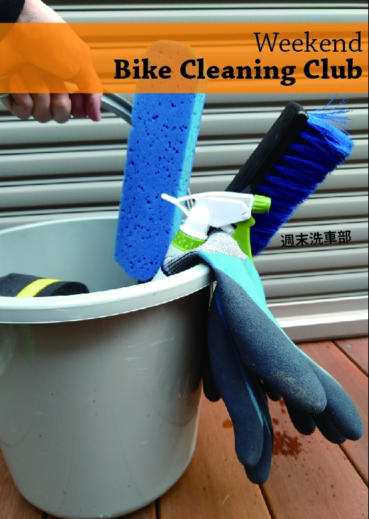

import SampleSlide from "../../../components/mdx/SampleSlide.astro"

## スペース・LINK

**1 日目(8/13) 東 5 ホール ル 15a**です

  

    
  

  

    
  

[コミケ Web カタログサークルページ](https://webcatalog.circle.ms/Perma/Circle/10349446/)

[Circle.ms サークルページ](https://portal.circle.ms/Circle/Index/10349446)

## 【新刊】サイクリング・デジタルトランスフォーメーション

デジタル機器でサイクリングライフを変革しよう！**自転車 YouTuber への試行錯誤ノウハウと、各種ログを全力活用したコンディション管理ノウハウ**を詰め込んだ1冊。

前半はアクションカメラ5機種のレビューと、マウント方法8種類をそれぞれの使い勝手・画角サンプルを交えた解説と、底辺自転車YouTuberが収益化するまでの体験談を掲載。

後半は、サイクルコンピューター・スマートウォッチの使いこなし・WEBサービスの連携設定をして、自分のコンディションを徹底的に可視化して、自分だけのデジタルトレーナー化する現代のサイクリングログ活用について。おすすめのWEBサービス・デバイスと合わせて説明。

ライド動画とライドログはもちろん、ライフログも合わせてあなたのサイクリングをDXしましょう

**本文 70 ページ**。

会場価格1000円

### 目次

以下のサンプルは執筆中のものです

<SampleSlide>

</SampleSlide>

### Special Thanks

- [Vivliostyle](https://vivliostyle.org/)
- [Inkscape](https://inkscape.org/)

### 通販・電子版

委託通販は[メロンブックス](https://www.melonbooks.co.jp/detail/detail.php?product_id=1579831)様、電子版はKindleでそれぞれ頒布・配信予定です。

なお、弊サークルの同人誌は全て[Kindle Unlimited](https://amzn.to/3GsXhaT)にて読み放題の対象となっています。複数冊購入の場合は非常にお得となっておりますのでご検討ください。

  

    
  

  

    
  

## 【既刊】Cyclocross Deep Dive

日本のシクロクロスを参戦し、観戦し、ネタにして楽しむための情報を可能な限り詰め込みました。国内のルール・機材運用・練習方法・観戦のコツ・レース当日の流れ・ネタ集など、C1エリートレーサー 2人でお送りするシクロクロス同人誌決定版。**本文 100 ページ**。

会場価格1000円

  

    
  

  

    
  

## 【既刊】週末洗車部

自宅でできる洗車方法を、フルサービス洗車から水無し洗車までバリエーション深く解説しつつ、汚れの質に応じた洗い方をおすすめする本です。
アパートぐらしにも関わらず毎週の洗車を運命づけられたシクロクロッサーによるノウハウを大公開します。

家人に宅内洗車を禁止された男に取材を敢行した「闇洗車」についてもコラムを書いています。必見！

会場価格500円

  

    
  

  

    
  

