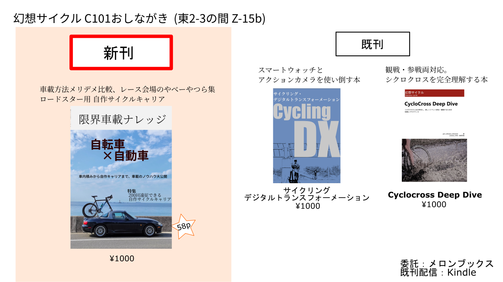

import SampleSlide from "../../../components/mdx/SampleSlide.astro"
export const samples = [
  "./c101_cover.png",
  "./c101_sample01.png",
  "./c101_sample02.png"
]

## スペース・LINK

**2 日目(12/31) 東 2 ホール Z-15b**です

### 関連リンク

- [コミケ Web カタログサークルページ](https://webcatalog.circle.ms/Perma/Circle/10349446/)
- [Circle.ms サークルページ](https://portal.circle.ms/Circle/Index/10349446)
- 既刊 1: [サイクリング・デジタルトランスフォーメーション](/c100/)
- 既刊 2: [Cyclocross Deep Dive](/c99/)

## 【新刊】限界車載ナレッジ

<!-- https://docs.astro.build/en/guides/assets/#getimage-astroassets -->
<!-- getimage()関数を呼び出して渡す必要あり？ -->
<!-- <SampleSlide sampleImageUrls={["./c101_cover.png"]} /> -->

ロードバイクなどの車載、なんとなくやっていませんか?

中積み・ルーフキャリア・トランクキャリア・吸盤キャリアなど、基本的な積み方のメリット・デメリットを比較して、レンタカーでも使えるノウハウを紹介しています。

メインコンテンツは、ロードスターの自作ルーフキャリア製作について!
「その気になればどんな車にも自転車が 2 台は乗る」を裏付ける試行錯誤をお楽しみあれ

**本文 58 ページ**。

会場価格 1000 円

### Special Thanks

- [Vivliostyle](https://vivliostyle.org/)
- [Inkscape](https://inkscape.org/)

### 通販・電子版

委託通販は[メロンブックス](https://www.melonbooks.co.jp/detail/detail.php?product_id=1747534)様、電子版は Kindle でそれぞれ頒布・配信予定です。

なお、弊サークルの同人誌は全て[Kindle Unlimited](https://amzn.to/3GsXhaT)にて読み放題の対象となっています。複数冊購入の場合は非常にお得となっておりますのでご検討ください。

  

    
  

