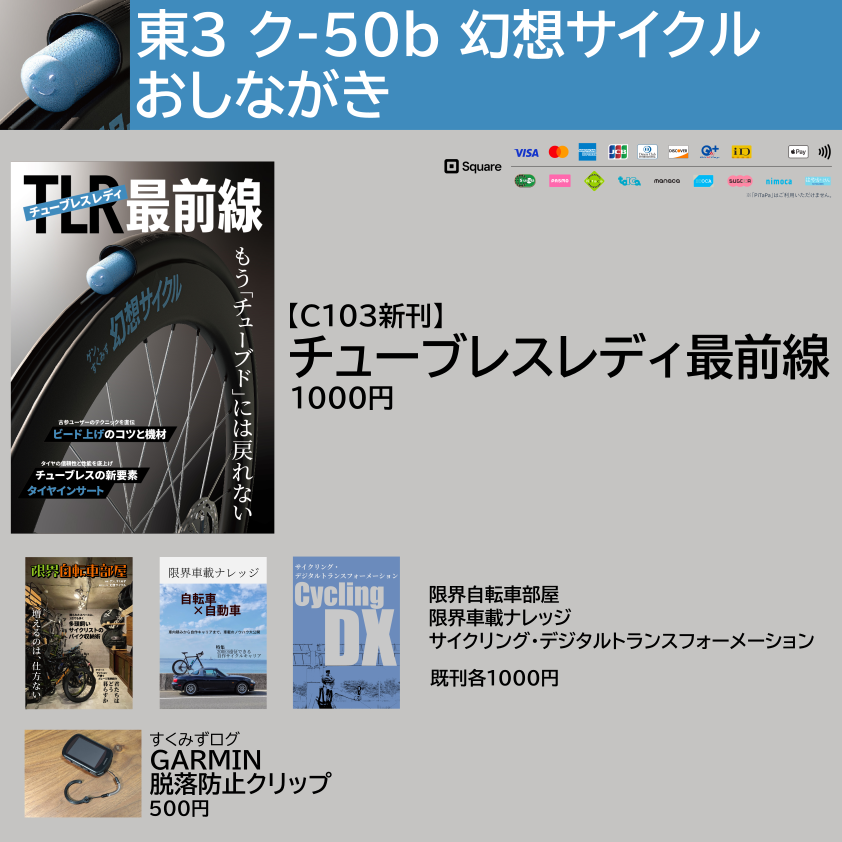
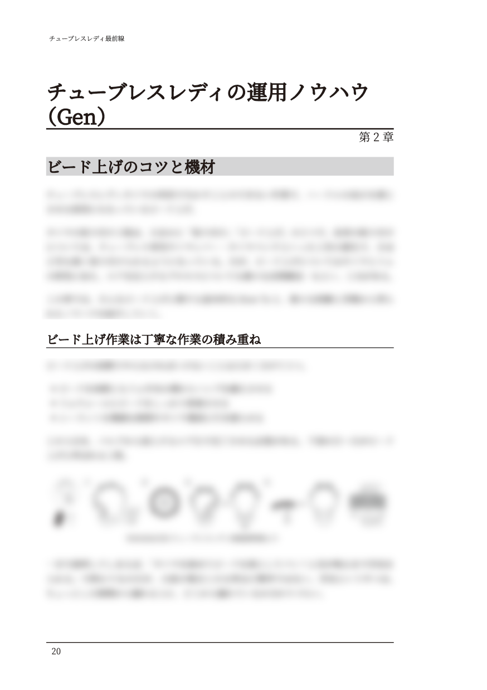
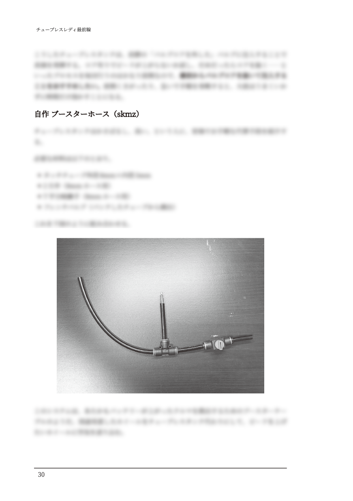
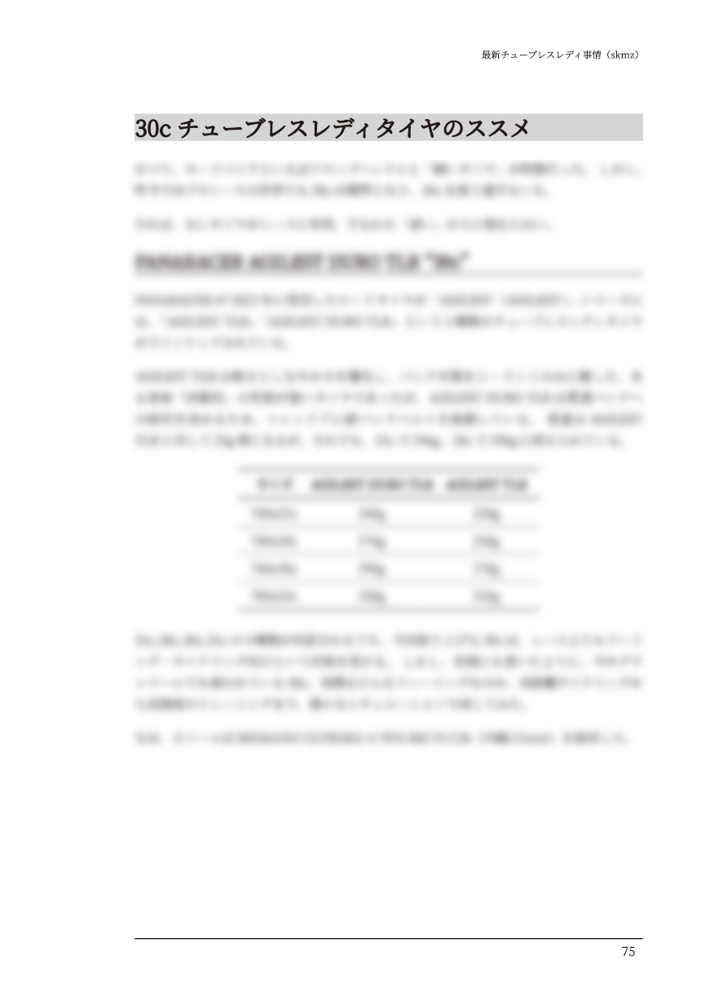
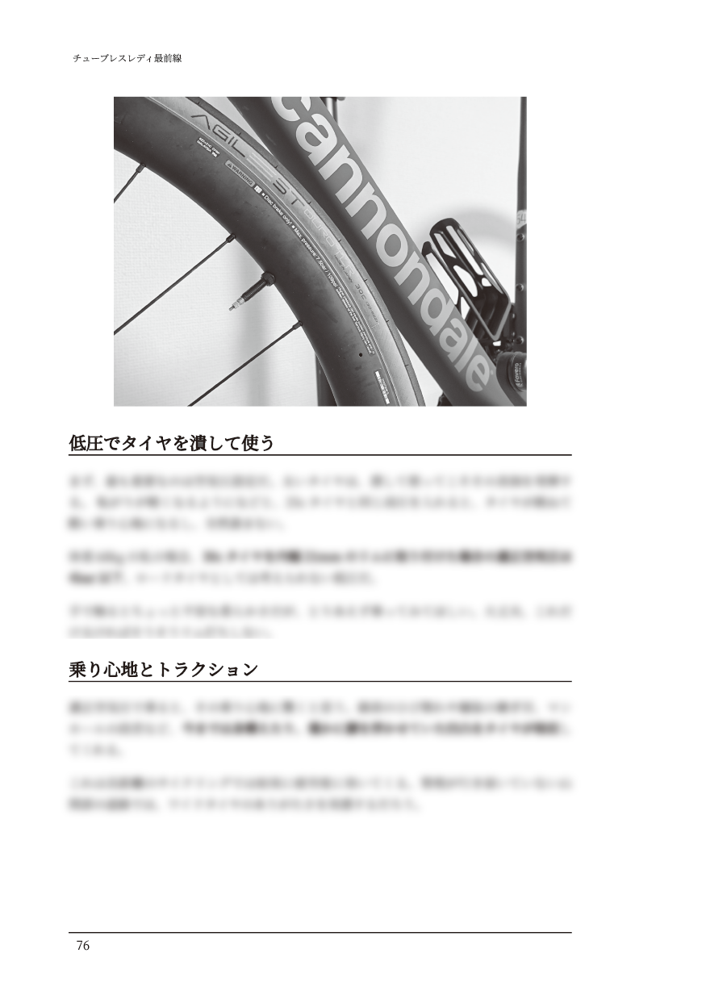
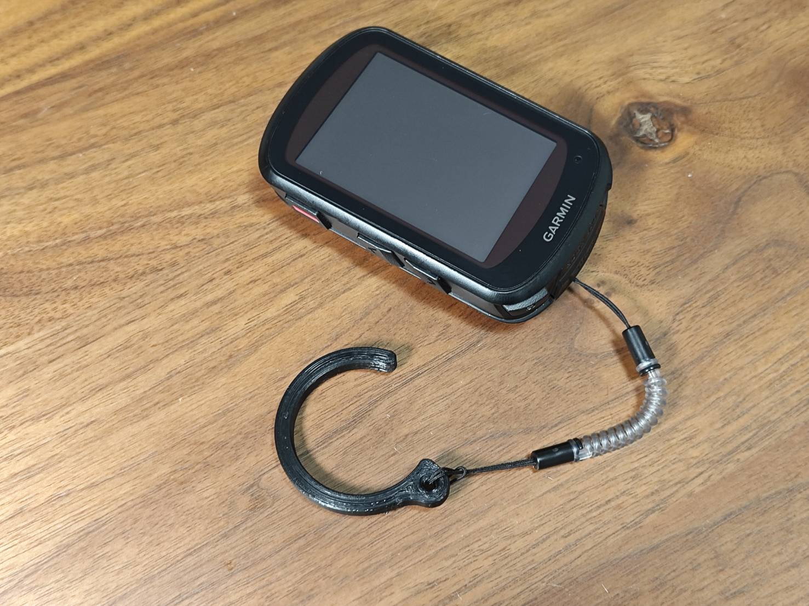
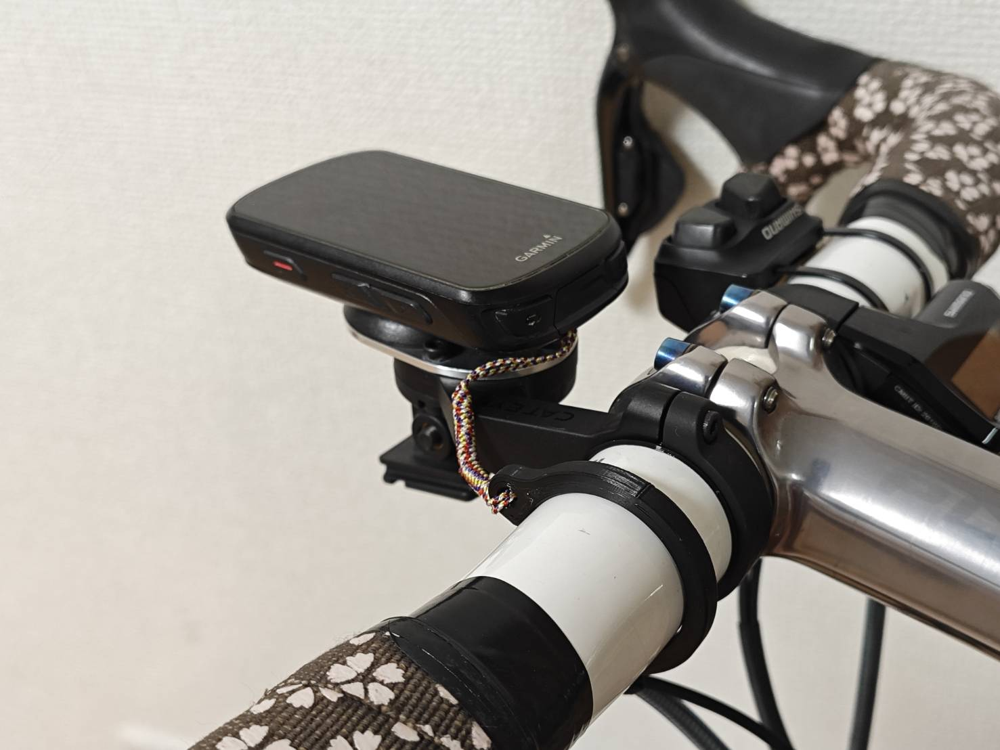
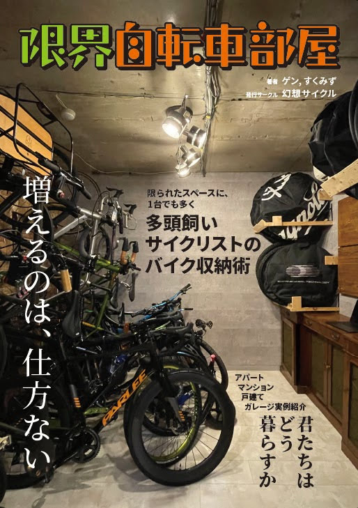
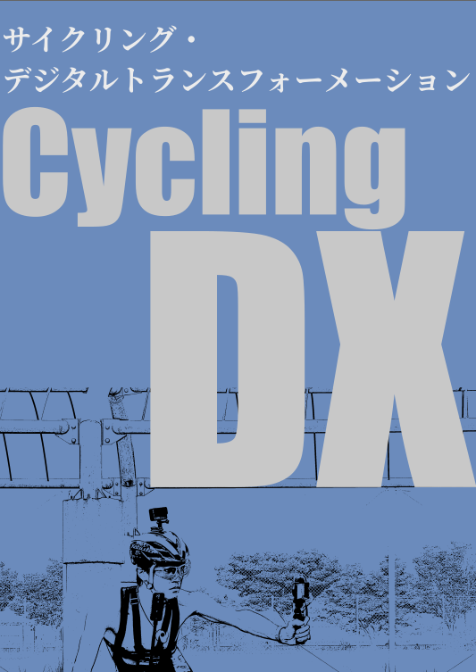

{/* <!-- textlint-disable --> */}

import SampleSlide from "../../../components/mdx/SampleSlide.astro"

{/* <!-- textlint-enable --> */}

コミックマーケット103に、同人サークル「[幻想サイクル](https://webcatalog.circle.ms/Perma/Circle/10349446/)」として参加します！

## おしながき

新刊および、既刊の『[限界自転車部屋](/c102/)』『[限界車載ナレッジ](/c101/)』『[サイクリング・デジタルトランスフォーメーション](/c100/)』を10数冊持ち込み予定です。すくみずログの3Dプリントグッズも販売します。

## チューブレスレディ最前線

<SampleSlide>

</SampleSlide>

ここ数年の間に、プロロードレースの世界で瞬く間に普及したチューブレスレディタイヤ。転がり、乗り心地、グリップに優れる28c～30cの幅広TLRタイヤは、今やプロトンの「常識」だ。

本書では、チューブレス歴10年以上の「古参勢」が、TLRシステムの運用ノウハウと最新トレンドを紹介・解説する。

ビード上げのコツや、ワイドタイヤの性能を活かす空気圧設定、TLRの性能を底上げするタイヤインサート、そして30cロードTLRタイヤ…

バイクの走りはタイヤが決める。\
…もう「チューブド」には戻れない

### 目次

1. はじめに
2. TLRの基礎知識
   1. 不完全で曖昧な チューブレス「レディ」
   2. 進化を続けるチューブレスホイール（リム）
   3. エア保持の要 タイヤシーラント
3. TLRの運用ノウハウ
   1. ビード上げのコツと機材
   2. パンク対応と日常点検のチェックポイント
4. 最新TLR事情
   1. タイヤ・リムのワイド化と新ETRTO規格
   2. ワイドリム時代の適正空気圧
   3. チューブレスの新要素 タイヤインサート
   4. 30cチューブレスレディタイヤのススメ
5. あとがき

### スペース情報

**2日目(12/31) 東ホール ク-50b**

- 本文80ページ
- 会場価格**1000円**

クレジットカード・交通系IC・iD・QUICPayでの決済OK！非接触決済にも対応しております。

## すくみずログ 3Dプリントグッズ

好評を博している3Dプリントグッズを頒布します。

アナウンスしていたブロンプトンハンドルバーキャッチは、耐久性に不備が発見されたため頒布を中止します。

### GARMIN 脱落防止クリップ

GARMINのサイクルコンピューターに付けるストラップ、そのままだとゴム紐を輪のように通してハンドルやアウトフロントマウントに取り付ける必要がある。

ただ、複数台を運用していると付け外しが大変なのも事実。しかし、高価なサイクルコンピューターに脱落防止機構を付けないというのも不安だ。

これは、31.8mmのハンドルにそのままパチッと嵌めこむことができるクリップ。弾力がありワンタッチで装着できるが、衝撃やひっぱりで外れないように設計された。今日はロード、明日はCX、明後日はグラベル…という人にぴったり。

  

    
  

詳細な説明は、[すくみずさんのブログ記事](https://skmzlog.com/garmin-tether-clip/)を参照してほしい。

**会場頒布価格500円。**

### 委託・電子版情報

委託通販は[メロンブックス様](https://www.melonbooks.co.jp/detail/detail.php?product_id=2194525)、電子版は [Kindle](https://amzn.to/48pihgF) でそれぞれ頒布・配信予定です。

なお、弊サークルの同人誌は全て[Kindle Unlimited](https://amzn.to/3GsXhaT)にて読み放題の対象となっています。複数冊購入の場合は非常にお得となっておりますのでご検討ください。

  

    
  

<blockquote class="twitter-tweet">
  

    いつも通り電子版の配信も行います。Kindleでの予約注文受付中です
    <a href="https://t.co/9YubpuNKtE">https://t.co/9YubpuNKtE</a>
  

  &mdash; ゲン@C103日曜東ク50b (@gen_sobunya) <a href="https://twitter.com/gen_sobunya/status/1736745444871725106?ref_src=twsrc%5Etfw">December 18, 2023</a>
</blockquote>

## 既刊：限界自転車部屋

自転車にもTPOがある。

舗装路を走るのにロードバイクを使い、河川敷や未舗装林道・グラベルを走るのにグラベルロードを使い、クロスカントリーレースではXCバイクに乗り、自走トレイルではハードテールのトレイルMTBを使い、ゲレンデではエンデューロバイクを駆り、ちょっとした旅行にはフォールディングバイクを持っていく。

もちろん、複数のジャンルにまたがって使うこともできる車種がほとんどだ。しかしそれは、決して専用のものに性能で優ることはない。かくして、自転車オタクの部屋はバイクで埋め尽くされる。

本書では、市販のバイクスタンドの特性から考える理想的な（最小スペースで最大台数を保管できる）配置を考えて、3Dシミュレーションによって実際の部屋のイメージを固める方法を紹介する。

また、第2章では実際の限界サイクリスト達に取材を行い、部屋に置ける工夫、物件選び、果ては注文住宅のこだわりポイントまで踏み込んだ実例を紹介していく。

## 既刊: 限界車載ナレッジ

中積み・ルーフキャリア・トランクキャリア・吸盤キャリアなど、基本的な積み方のメリット・デメリットを比較して、レンタカーでも使えるノウハウを紹介しています。

メインコンテンツは、ロードスターの自作ルーフキャリア製作について！

## 既刊：サイクリング・デジタルトランスフォーメーション

デジタル機器でサイクリングライフを変革しよう！**自転車 YouTuber への試行錯誤ノウハウと、各種ログを全力活用したコンディション管理ノウハウ**を詰め込んだ 1 冊。

前半はアクションカメラ 5 機種のレビューと、マウント方法 8 種類をそれぞれの使い勝手・画角サンプルを交えた解説と、底辺自転車 YouTuber が収益化するまでの体験談を掲載。

後半は、サイクルコンピューター・スマートウォッチの使いこなし・WEB サービスの連携設定をして、自分のコンディションを徹底的に可視化して、自分だけのデジタルトレーナー化する現代のサイクリングログ活用について。おすすめの WEB サービス・デバイスと合わせて説明。

ライド動画とライドログはもちろん、ライフログも合わせてあなたのサイクリングを DX しましょう

## 関連リンク

- [コミケ Web カタログサークルページ](https://webcatalog.circle.ms/Perma/Circle/10349446/)
- [Circle.ms サークルページ](https://portal.circle.ms/Circle/Index/10349446)
- 既刊1: [限界車載ナレッジ](/c101/)

### Special Thanks

- [Vivliostyle](https://vivliostyle.org/)
- [Inkscape](https://inkscape.org/)
