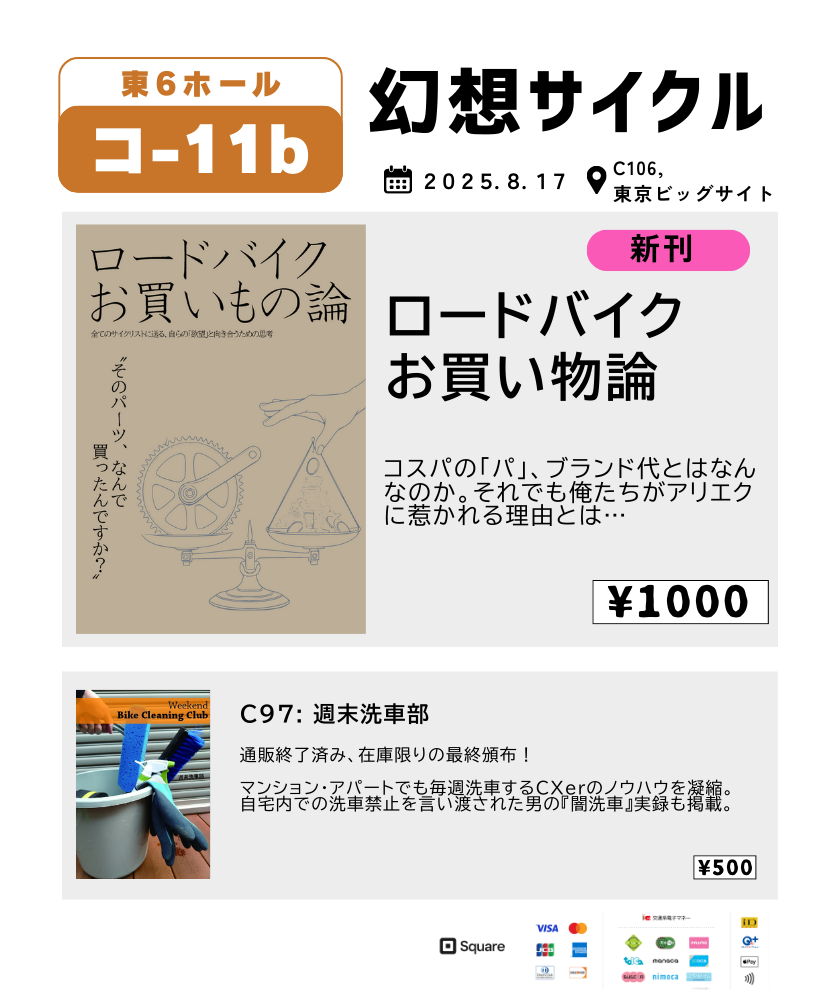
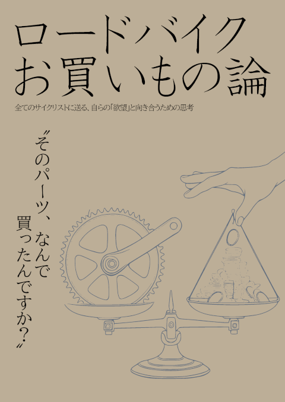
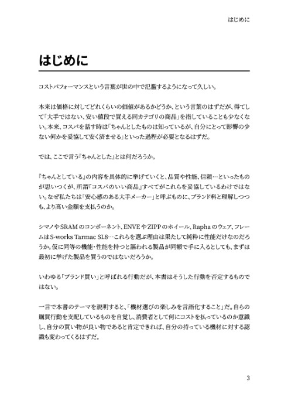
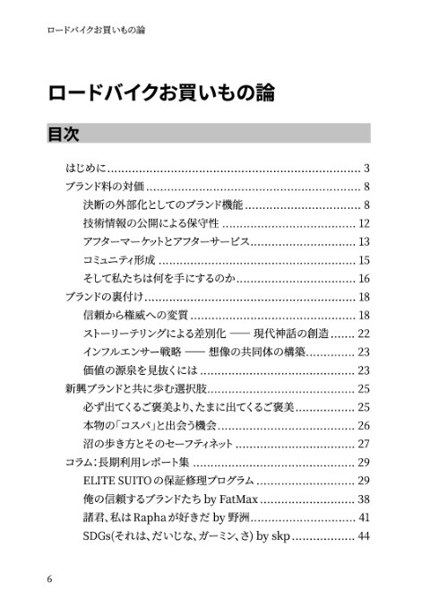
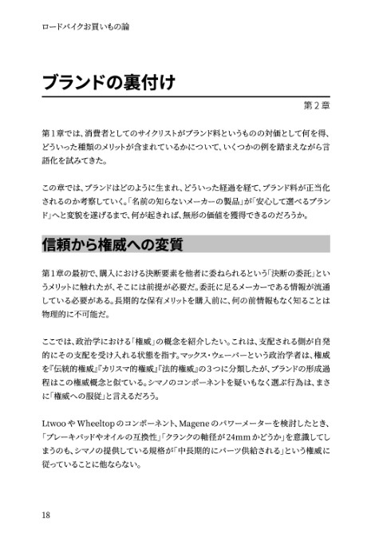
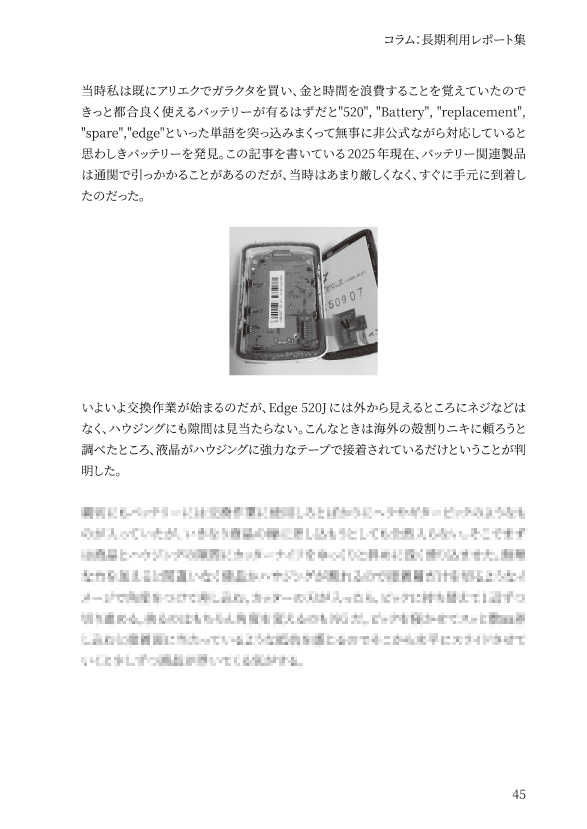

{/* <!-- textlint-disable --> */}

import SampleSlide from "../../../components/mdx/SampleSlide.astro"

{/* <!-- textlint-enable --> */}

コミックマーケット106に、同人サークル「[幻想サイクル](https://webcatalog.circle.ms/Perma/Circle/10349446/)」として参加します！

## おしながき

## チューブレスレディ最前線

<SampleSlide>

</SampleSlide>

コスパの「パ」、パフォーマンスって何ですか？

名の通ったものと比べて、安ければコスパが良いと思っていませんか？

ブランド料は何の対価なのか？性能と機能以外の価値とは何なのか？どんなに頭で理解していても、怪しいパーツを買ってしまうのはなぜ？

2年ぶりのコミケ参加では、ぼんやりと分かっているつもりの「ブランド価値」にフォーカス。
機能性能以外の価値とは具体的に何なのか、ブランドはどう育つのか、それでも玉石混交が欲しくなる心理とは、胡乱な蘊蓄と一緒に論じていきます！

後半では、長く使われるブランド製品の価値を示す例として、RCCの参加体験談や、GarminのDIY修理、某スマートトレーナーの保証修理体験談などを掲載

新興ブランドが勢いを増す中、実績のある大手メーカーや『ブランド料』を取っていると感じる製品が提供している価値とは何なのか、今一度言語化していく。

普段はプリセールスとして、機能や価格以外の価値、製品との付き合い方を理解してもらうお仕事をしているのですが、この時によく話す内容を自転車業界に落とし込んでいます（大学の専攻も一部漏れ出てます）

### スペース情報

**2日目(8/17) 東6ホール ク-11b**

- 本文60ページ
- 会場価格**1000円**

クレジットカード・交通系IC・iD・QUICPayでの決済OK！非接触決済にも対応しております。

### 委託・電子版情報

委託通販は[メロンブックス様](https://www.melonbooks.co.jp/detail/detail.php?product_id=3163402)、電子版は [Kindle](https://amzn.to/3JgexXJ) でそれぞれ頒布・配信予定です。

なお、弊サークルの同人誌は全て[Kindle Unlimited](https://amzn.to/3GsXhaT)にて読み放題の対象となっています。複数冊購入の場合は非常にお得となっておりますのでご検討ください。

  

    
  

<blockquote class="twitter-tweet">
  

    過去の本と同じく、フルカラー写真になったKindle電子版（1250円）の配信を予定しています。現在予約受付中！
     
    Kindle Unlimited対象になっているので、会員の方は無料で読めます
    <a href="https://t.co/wlQSjAQ877">https://t.co/wlQSjAQ877</a>
  

  &mdash; ゲン＠C106 日曜東6コ-11b (@gen_sobunya) <a href="https://twitter.com/gen_sobunya/status/1955587633931014251?ref_src=twsrc%5Etfw">August 13, 2025</a>
</blockquote>

## 関連リンク

- [コミケ Web カタログサークルページ](https://webcatalog.circle.ms/Perma/Circle/10349446/)
- [Circle.ms サークルページ](https://portal.circle.ms/Circle/Index/10349446)

### 寄稿者紹介

第4章にて体験談を寄稿いただいた皆様を紹介。

- 野洲 [@v_x_r_s](https://x.com/v_x_r_s)
- SKP [@sakimopuro](https://x.com/sakimopuro)
- [Ride Eat Sleep Repeat!](https://note.com/bikes)

### Special Thanks Tools

- [Vivliostyle](https://vivliostyle.org/)
- [Inkscape](https://inkscape.org/)
- [Canva](https://www.canva.com/)
