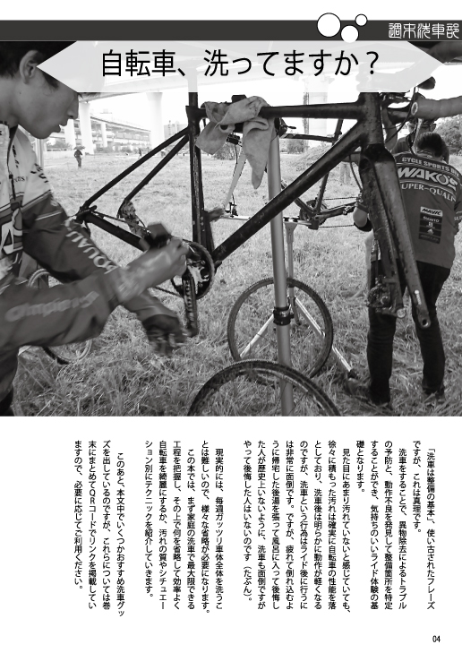
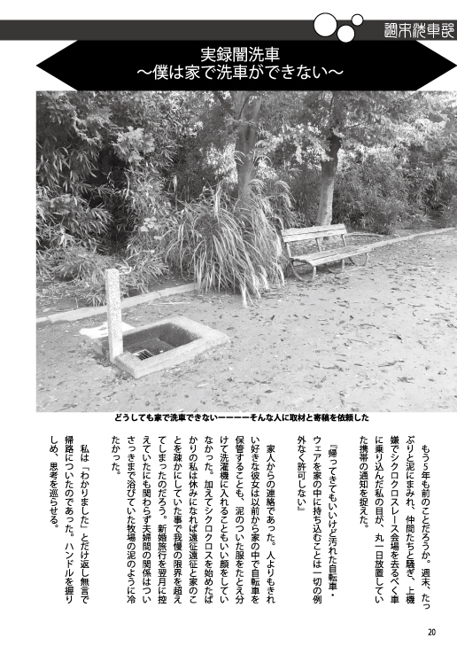

## スペース

**4 日目(12/31) 西 2 き 44b**です

## おしながき

幻想サイクルの本はすべて 500 円で頒布します。
「ホビーレースのすゝめ」「銀輪練之概略」は在庫がなくなりましたので以後[Kindle](https://amzn.to/2Ls8KPj)での販売のみとなります。

## 【新刊】週末洗車部

自宅でできる洗車方法を、フルサービス洗車から水無し洗車までバリエーション深く解説しつつ、汚れの質に応じた洗い方をおすすめする本です。
アパートぐらしにも関わらず毎週の洗車を運命づけられたシクロクロッサーによるノウハウを大公開します。

家人に宅内洗車を禁止された男に取材を敢行した「闇洗車」についてもコラムを書いています。必見！

### 通販・電子版

委託通販は[メロンブックス](https://www.melonbooks.co.jp/detail/detail.php?product_id=595340)様、電子版は[Kindle](https://amzn.to/34jEM5w)でそれぞれ予約受付中です。

## 【既刊】泥輪事情

シクロクロスの魅力をあらゆる面からアピールし、シクロクロス人口を爆増させる事を目的とした本です。気合が入りすぎてまずページ数が普段の 1.5 倍以上になってしまいました。

シクロクロスレースに関するカテゴリシステムや機材の疑問を紹介しつつ、Twitter 上で行ったシクロクロッサーへのアンケートや、シクロクロスを語る上で欠かせない「フォトグラファー」達からシクロクロスの魅力を語ってもらいます。
おまけで筆者が 2018 年の CX 全日本選手権に参加したレポートを載せています。
全**56**ページ、頒布価格￥ 500

## 【既刊】大阪北部飯ポタ本＋

大阪北部の飯ポタスポットを、エネルギー消費のためのライド情報と一緒に紹介。\
おまけとして、「神奈川県民でも満足できる大阪の家系ラーメン屋」を収録。\
全 32 ページ、頒布価格￥ 500

## 【既刊】2017 冬王滝　現場レポート

氷点下のスタート、過去最長の 100km コース、凍りつく機材…11 月の王滝で何が起こっていたのか？完走率 25%のアドベンチャーレースの記憶をたどる。\
会場限定。全 44 ページ、頒布価格￥ 500

